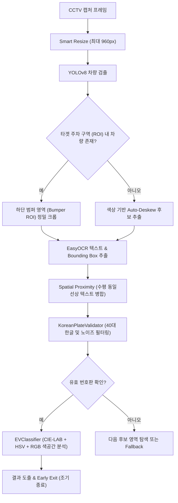

# ⚡ CCTV EV Detector (한국 전기차 충전소 스마트 관제 시스템)
## 📖 개발자 인수인계 및 운영 기술 가이드 (Developer & Operation Handover Guide)

> 본 문서는 프로젝트의 전체적인 아키텍처, 기술 스택, AI/LPR 파이프라인 알고리즘, CSMS 충전기 연동 로직, 실행 및 배포 방법, 트러블슈팅 가이드를 한국어로 상세히 정리한 **공식 인수인계 문서**입니다.

---

## 1. 📌 프로젝트 개요 (Overview)

**CCTV EV Detector**는 한국 내 전기차(EV) 전용 충전 구역의 CCTV 영상을 실시간으로 분석하여 다음과 같은 핵심 기능을 수행하는 **100% 온프레미스(On-Premise) 스마트 영상 관제 시스템**입니다.

* **차량 번호판 자동 인식 (LPR / ANPR):** YOLOv8 차량 검출 + 자동 기울기 보정(Auto-Deskewing) + EasyOCR을 통한 한글/숫자 번호판 정밀 추출.
* **전기차(EV) / 일반차량(ICE) 자동 분류:** CIE-LAB, HSV, Normalized RGB 다중 색공간 분석을 통해 한국 전기차 전용 하늘색 번호판 판별.
* **충전기 하드웨어 실시간 연동 (CSMS DB):** 커넥터 연결 상태, 충전 중 전력(kW), 충전량(kWh), 배터리 SoC(%)와 CCTV 주차 세션을 상호 교차 검증.
* **3대 충전 방해 및 불법 주차 위반 실시간 감지:**
  1. `NON_EV_PARKED`: 전기차 충전 구역에 일반 내연기관 차량 주차 시 경고.
  2. `NOT_CHARGING`: 전기차 주차 후 유예 시간(5분) 내 충전 미시작 시 경고.
  3. `OVERSTAY`: 배터리 100% 완충 또는 충전 종료 후 5분 이상 장기 점유 시 경고.
* **제로 외부 API 종속성:** 외부 유료 API(OpenAI, Google Cloud Vision 등) 없이 서버 내부에서 완결 실행되는 로컬 AI 엔진.

---

## 2. 🛠️ 기술 스택 (Tech Stack)

| 구분 | 사용 기술 / 라이브러리 | 버전 / 비고 |
| :--- | :--- | :--- |
| **Backend Framework** | **FastAPI** | `>= 0.100.0` (비동기 ASGI 웹 프레임워크) |
| **ASGI Web Server** | **Uvicorn** | `>= 0.23.0` (Standard uvloop 기반) |
| **Data Validation** | **Pydantic v2 / Pydantic-Settings** | `>= 2.0.0` (강력한 타입 및 환경변수 검증) |
| **ORM & Database** | **SQLAlchemy 2.0 + PyMySQL** | MySQL / MariaDB 연동 (Connection Pool 최적화) |
| **AI / Deep Learning** | **PyTorch + Ultralytics YOLOv8** | `yolov8n.pt` (차량 및 바운딩 박스 검출) |
| **Korean OCR** | **EasyOCR (CRAFT + ResNet/CTC)** | `craft_mlt_25k.pth`, `korean_g2.pth` (오프라인 탑재) |
| **Image Processing** | **OpenCV (Headless) + NumPy** | 번호판 회전 보정, 다중 색공간 분석, 초해상도 줌 |
| **Frontend UI** | **Jinja2 + Tailwind CSS + Alpine.js** | 단일 페이지 실시간 관제 대시보드 (한국어/우즈베크어) |

---

## 3. 📂 디렉토리 구조 및 핵심 모듈 설명

```plaintext
CCTV-Detector/
├── .env.example             # 환경 변수 템플릿 파일
├── .env                     # 실제 환경 변수 (DB 접속정보, 경로 등)
├── requirements.txt         # Python 의존성 패키지 목록
├── run.py                   # 애플리케이션 시작 진입점
├── run.sh                   # 백그라운드 구동 쉘 스크립트 (nohup)
├── stop.sh                  # 프로세스 안전 종료 쉘 스크립트
├── update.sh                # Git Pull 및 자동 재시작 스크립트
├── DEPLOYMENT.md            # 서버 배포 가이드
├── README.md                # 영문/한글 요약 소개서
├── README_KR.md             # [본 문서] 상세 인수인계 가이드
│
├── models/                  # AI 모델 가중치 파일 저장소
│   ├── yolov8n.pt           # YOLOv8 차량 검출 모델
│   └── easyocr/             # EasyOCR 오프라인 모델 (CRAFT, Korean G2, English G2)
│
├── storage/                 # 캡처 스냅샷 및 크롭 이미지 저장 경로
│   └── snapshots/           # 날짜별(YYYY/MM/DD) 자동 분류 저장
│
├── scripts/
│   └── purge_data.py        # 운영 환경 초기화 및 데이터 정리 CLI
│
├── tests/                   # 자동화 단위/통합 테스트 슈트
│   ├── test_parking_session.py
│   ├── test_charger_service.py
│   ├── test_cable_occlusion.py
│   ├── test_target_bay_roi.py
│   └── test_vehicles_api.py
│
└── app/                     # 메인 애플리케이션 소스코드
    ├── main.py              # FastAPI 앱 인스턴스, Lifespan 및 라우터 마운트
    │
    ├── core/
    │   ├── config.py        # Pydantic 기반 설정 관리 및 한국 표준시(KST) 처리
    │   └── database.py      # SQLAlchemy 엔진 (로컬 DB + CSMS 클라우드 DB 연결)
    │
    ├── models/
    │   └── snapshot.py      # DB ORM 모델 (CCTVSnapshot, CCTVCamera)
    │
    ├── schemas/
    │   └── snapshot.py      # Pydantic 입출력 DTO 스키마
    │
    ├── services/
    │   ├── camera_service.py   # RTSP/HTTP/ONVIF 카메라 통신 및 스트림 허브
    │   ├── charger_service.py  # CSMS DB 실시간 충전기 데이터 조회 및 위반 판별
    │   ├── monitor_service.py  # 백그라운드 실시간 주차 세션 & 상태 관리자
    │   ├── storage_service.py  # 로컬 디스크 파일 저장 및 Base64 처리
    │   │
    │   └── detector/           # 🧠 핵심 AI LPR 및 분류 파이프라인
    │       ├── pipeline.py        # 전체 감지 파이프라인 통합 제어 (Early Exit)
    │       ├── plate_detector.py  # YOLOv8 차량/범퍼 영역 검출
    │       ├── plate_reader.py    # EasyOCR 텍스트/좌표 추출
    │       ├── plate_validator.py # 40대 한글 정규식 및 케이블 가림 복원
    │       └── ev_classifier.py   # Multi-Spectral 하늘색 번호판 판별기
    │
    ├── api/
    │   └── v1/
    │       ├── detect.py    # 이미지 수동 업로드 분석 API
    │       ├── vehicles.py  # 차량 감지 이력 조회, 이미지 뷰, CSV 엑셀 다운로드
    │       ├── cameras.py   # 카메라 등록/수정/삭제, 상태 및 실시간 MJPEG 스트리밍
    │       ├── stats.py     # 대시보드 상단 통계 수치 집계 API
    │       └── admin.py     # 세션 리셋 및 데이터 초기화 API
    │
    └── templates/
        └── dashboard.html   # 관제 화면 (실시간 슬롯 HUD, 실시간 체류시간, 한국어 뷰)
```

---

## 4. 🧠 AI & LPR / EV 분류 파이프라인 동작 원리

전체 LPR 파이프라인은 영상 1장당 **평균 150ms ~ 300ms** 내외로 초고속 처리되도록 최적화되어 있습니다.



### 1) 번호판 정규식 검증 (`KoreanPlateValidator`)
* **신형 8자리:** `123가 4567` (숫자 3자리 + 한글 1자리 + 숫자 4자리)
* **구형 7자리:** `81머 2072` (숫자 2자리 + 한글 1자리 + 숫자 4자리)
* **지역 표기형:** `서울12가 3456`
* **엄격한 한글 화이트리스트:** 자가용 32자, 렌터카 3자(`하/허/호`), 영업용 4자(`아/바/사/자`), 택배 1자(`배`) 등 **공식 40자 외에는 100% 필터링**하여 전화번호 스티커나 안내문 오인식을 방지합니다.

### 2) 충전 케이블 가림 보정 알고리즘 (`is_cable_occlusion_match`)
* 수직 충전 케이블이 번호판을 가로질러 글자 일부가 훼손되더라도(예: `47호6633` $\leftrightarrow$ `47오3633`, `312버6132` $\leftrightarrow$ `312버8132`) 동일 차량으로 정확히 매칭하여 **주차 세션이 끊기지 않고 연속 유지**됩니다.

### 3) Multi-Spectral EV 판별기 (`EVClassifier`)
* Otsu 임계화를 통해 검은색 글자를 제외하고 **순수 번호판 배경 픽셀만 분리**합니다.
* CIE-LAB의 $b^*$ 채널(Blue-Yellow 대립), HSV 색상 범위, 정규화 RGB 채널을 종합 평가하여 조명 변화나 역광에서도 파란색 번호판을 정확히 판별합니다.
* 한 번 EV로 판별된 번호판은 인메모리 레지스트리에 자동 등록되어 이후 반사광 발생 시에도 오분류를 방지합니다.

---

## 5. 🔌 충전기(CSMS) 하드웨어 연동 & 주차 세션 관리

### 1) 주차 세션 수명 주기 (`AutoMonitorService`)
1. **차량 입차 (`START`):**
   * 슬롯이 비어있던 상태에서 새 번호판 감지 시 고유 `session_id`를 생성하고 DB에 `START` 레코드 1건만 기록합니다.
   * 이때 캡처 원본 및 번호판 크롭 Base64를 DB에 저장합니다.
2. **주차 유지 (Zero DB Write):**
   * 주기적(10초) 검사에서 동일 차량이 계속 감지되면 DB 쓰기 없이 메모리 상의 `last_seen_at` 시간만 갱신합니다.
3. **차량 출차 (`END`):**
   * 연속 3회(`exit_threshold_cycles=3`) 동안 차량이 감지되지 않으면 출차로 확정하고, 정확한 총 주차 체류시간을 계산하여 `END` 레코드 1건을 기록하고 세션을 종료합니다.

### 2) CSMS 하드웨어 그라운드 트루스 연동
* **`TINF_CP_CONNECTOR_STATUS` & `TINF_CURRENT_TX` 조회:**
  * 차량이 물리적으로 케이블에 꽂혀있는 동안(`CHARGING`, `PREPARING`, `SUSPENDEDEV` 등)은 조명이나 사각지대로 인해 번호판이 일시 미인식되더라도 주차 세션을 강제로 유지합니다.
  * 배터리 충전량(SoC %), 충전 전력(kW), 충전 시간 정보를 실시간 대시보드 HUD에 표출합니다.

---

## 6. ⚙️ 환경 설정 (.env 가이드)

프로젝트 루트의 `.env` 파일에서 주요 환경변수를 설정할 수 있습니다:

```ini
# [서버 기본 설정]
APP_NAME=CCTV-EV-Detector
APP_ENV=development
DEBUG=True
SERVER_HOST=0.0.0.0
SERVER_PORT=8000

# [로컬 관제 MySQL 데이터베이스]
DB_HOST=211.253.38.156
DB_PORT=3306
DB_USER=blue_networks
DB_PASSWORD=blue_networks
DB_NAME=blue_networks
DB_POOL_SIZE=30
DB_MAX_OVERFLOW=50

# [CSMS 클라우드 데이터베이스 (충전기 데이터 읽기 전용)]
CSMS_DB_HOST=211.252.86.250
CSMS_DB_PORT=3306
CSMS_DB_USER=blue_networks
CSMS_DB_PASSWORD=blue_networks
CSMS_DB_NAME=blue_networks

# [AI 및 모니터링 주기 설정]
YOLO_MODEL_PATH=models/yolov8n.pt
YOLO_CONFIDENCE=0.25
MONITOR_INTERVAL_SECONDS=10
MONITOR_ENABLED=True
STORAGE_DIR=storage/snapshots
```

---

## 7. 🚀 실행 및 운영 방법

### 1) 사전 준비 (최초 1회)
```bash
# 1. 가상환경 생성 및 활성화
python3 -m venv venv
source venv/bin/activate

# 2. 필수 라이브러리 설치
pip install --upgrade pip
pip install -r requirements.txt
```

### 2) 서비스 시작 / 중지 / 업데이트
* **포그라운드 개발 모드 실행:**
  ```bash
  python run.py
  ```
* **백그라운드 서비스 시작 (운영 모드):**
  ```bash
  ./run.sh
  ```
* **서비스 중지:**
  ```bash
  ./stop.sh
  ```
* **최신 코드 반영 및 자동 재시작:**
  ```bash
  ./update.sh
  ```

브라우저에서 `http://localhost:8000` 접속 시 **실시간 관제 대시보드**가 열립니다. (Swagger API 문서는 `http://localhost:8000/docs`)

---

## 8. 📡 주요 REST API 명세

| Method | URI | 설명 |
| :--- | :--- | :--- |
| `GET` | `/` | 관제 대시보드 웹 UI |
| `GET` | `/health` | 서버 및 백그라운드 모니터 헬스체크 |
| `POST` | `/api/v1/detect/upload` | 차량 사진 업로드 수동 LPR & EV 판별 |
| `GET` | `/api/v1/vehicles` | 감지 차량 목록 조회 (페이지네이션, EV/날짜/위반 필터링) |
| `GET` | `/api/v1/vehicles/export` | 차량 감지 이력 한국어 CSV/Excel 다운로드 (BOM 지원) |
| `GET` | `/api/v1/vehicles/{id}/image` | 차량 캡처 원본 이미지 조회 (Base64/세션 폴백) |
| `GET` | `/api/v1/vehicles/{id}/plate-image` | 번호판 크롭 썸네일 이미지 조회 |
| `GET` | `/api/v1/cameras` | 등록된 CCTV 카메라 목록 조회 |
| `POST` | `/api/v1/cameras` | 신규 CCTV 카메라 등록 (RTSP / HTTP) |
| `POST` | `/api/v1/cameras/probe` | 카메라 IP/포트/경로 자동 검색 및 연결 테스트 |
| `GET` | `/api/v1/cameras/slots-status` | 전체 충전소 슬롯별 실시간 점유/충전/위반 상태 |
| `GET` | `/api/v1/cameras/{id}/live` | 브라우저 0초 지연 실시간 MJPEG 비디오 스트림 |
| `GET` | `/api/v1/stats/summary` | 오늘/누적 감지 통계 및 위반 건수 요약 |
| `POST` | `/api/v1/admin/purge-data` | 테스트 데이터 및 스냅샷 전체 초기화 (운영 배포 시) |
| `POST` | `/api/v1/admin/reset-sessions` | 인메모리 주차 세션 리셋 |

---

## 9. 🧪 테스트 실행 방법

프로젝트에는 각 핵심 기능에 대한 단위 및 통합 테스트가 완비되어 있습니다.

```bash
# 가상환경 활성화
source venv/bin/activate

# 1. 전체 테스트 실행
pytest tests/ -v

# 2. 주차 세션 수명 주기 및 디바운스 테스트
pytest tests/test_parking_session.py -v

# 3. 충전기 연동 및 위반 감지 테스트
pytest tests/test_charger_service.py -v

# 4. 케이블 가림 번호판 복원 테스트
pytest tests/test_cable_occlusion.py -v
```

---

## 10. ⚠️ 인수인계 핵심 주의사항 및 팁 (Troubleshooting)

1. **EasyOCR 오프라인 모델 경로:**
   * 서버가 폐쇄망이거나 인터넷이 제한된 환경일 경우 `models/easyocr/` 폴더 내에 `craft_mlt_25k.pth`, `korean_g2.pth`, `english_g2.pth` 파일이 반드시 존재해야 합니다. (이미 포함되어 있음)
2. **카메라 연결 지연(Timeout) 방지:**
   * RTSP 연결 시 `app/services/camera_service.py` 내의 `RTSPStreamHub`가 백그라운드 스레드에서 최신 프레임을 지속적으로 비우므로 소켓 버퍼링 딜레이가 없습니다.
3. **CSMS DB 연결 끊김 처리 (Circuit Breaker):**
   * 외부 CSMS 클라우드 DB 연결이 일시적으로 불안정할 경우, 시스템 전체가 멈추지 않도록 30초 동안 쿼리를 스킵하고 로컬 캐시로 안전하게 폴백(Circuit Breaker) 동작합니다.
4. **이미지 저장 및 뷰 폴백(Fallback):**
   * 서버 분산 환경이나 디스크 경로 변경으로 인해 원본 파일이 없더라도 DB의 `plate_region_image` 컬럼에 Base64로 보관된 썸네일과 `START` 세션 데이터가 자동 연결되어 UI에서 엑박(Broken image)이 발생하지 않습니다.
5. **운영 배포 전 초기화:**
   * 테스트 데이터 삭제는 대시보드 상단의 **"시스템 초기화"** 버튼 또는 `python scripts/purge_data.py --all -y` 명령어를 사용하시면 됩니다.

---
*작성일: 2026-09-18 | CCTV-EV-Detector 개발팀*
